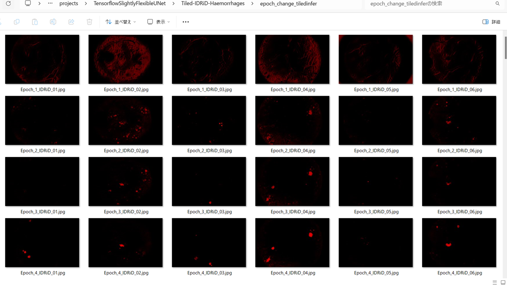
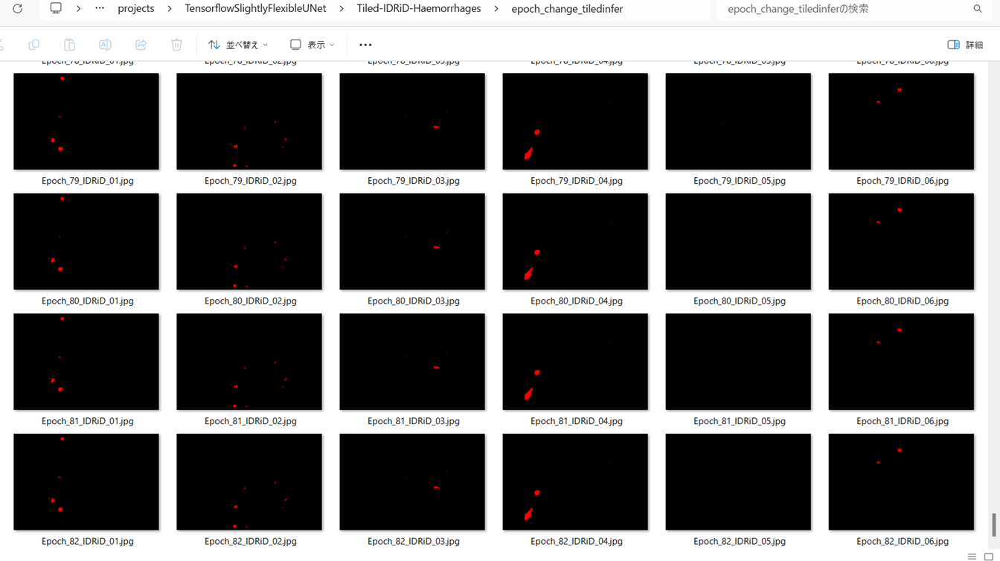

<h2>Tensorflow-Tiled-Image-Segmentation-IDRiD-Haemorrhages (2025/04/08)</h2>

Sarah A. Arai  
Software Laboratory antillia.com  

This is the first experiment of Tiled Image Segmentation for IDRiD-Haemorrhages 
 based on 
the latest <a href="https://github.com/sarah-antillia/Tensorflow-Image-Segmentation-API">Tensorflow-Image-Segmentation-API</a>, 
and a tiled dataset <a href="https://drive.google.com/file/d/1AtkPZyZiC9b9HtuW-ou1CUQGppGnZpQd/view?usp=sharing">
Tiled-IDRiD-Haemorrhages-ImageMask-Dataset.zip</a>, which was derived by us from Segmentation dataset of
<a href="https://ieee-dataport.org/open-access/indian-diabetic-retinopathy-image-dataset-idrid">
<b>
Indian Diabetic Retinopathy Image Dataset (IDRiD)
</b>
</a>
 
 
Please see also our experiment  
<a href="https://github.com/sarah-antillia/Tensorflow-Tiled-Image-Segmentation-Pre-Augmented-IDRiD-HardExudates">
Tensorflow-Tiled-Image-Segmentation-Pre-Augmented-IDRiD-HardExudates
</a>
 
 
<b>Tiled Image Segmentation</b> 
This is one of the divide and conquer algorithms in UNet segmentation model. 
The pixel size of the images of IDRiD is 4288x2848, which is too large to use for a training dataset of a simple UNet model.
For segmentation of large images using UNet, employing the algorithm is a good idea. 
Since large images cannot be processed all at once, they are divided into small tiles. 
Segmentation processing is then applied to these divided small images, and finally, they are reassembled to their original size.
 
 
<b>Experiment Strategies</b> 
In this experiment, we employed the following strategies.
 
<b>1. Create Tiled ImageMask Dataset</b> 
We created Tiled-IDRiD-Haemorrhages-ImageMask-Dataset, which was tiledly-splitted to 512x512 pixels 
and reduced to 512x512 pixels image and mask dataset from the original 4288x2848 pixels images and mask files. 
 

<b>2. Train UNet Model by Tiled ImageMask Dataset</b> 
We trained and validated a TensorFlow UNet model using the Tiled IDRiD Haemorrhages train and valid datasets, which was tiledly-splitted to 512x512 pixels 
and reduced to 512x512 pixels image and mask dataset from the original 4288x2848 pixels images and mask files. 
 
<b>3. Evaluate UNet Model performance</b> 
We evaluated the performance of the trained TensorFlow UNet model by using the Tiled IDRiD Haemorrhages test dataset 
 

<b>4. Apply Tiled Image Segmentation</b> 
We applied our Tiled-Image Segmentation inference method to predict the Haemorrhages regions for the mini_test images 
with a resolution of 4288x2848 pixels.  

<b>Actual Tiled Image Segmentation for Images of 4288x2848 pixels</b> 
As shown below, the segmentation result is unsatisfactory, the inferred masks look somewhat similar to the ground truth masks, but they lack precision in certain areas.
 
<table>
<tr>
<th>Input: image</th>
<th>Mask (ground_truth)</th>
<th>Prediction: Tiled_inferred_mask</th>
</tr>
<tr>
<td></td>
<td></td>
<td></td>
</tr>

<tr>
<td></td>
<td></td>
<td></td>
</tr>

<tr>
<td></td>
<td></td>
<td></td>
</tr>

</table>

 
In this experiment, we used the simple UNet Model 
<a href="./src/TensorflowUNet.py">TensorflowSlightlyFlexibleUNet</a> for this IDRiD-Haemorrhages Segmentation Model. 
As shown in <a href="https://github.com/sarah-antillia/Tensorflow-Image-Segmentation-API">Tensorflow-Image-Segmentation-API</a>.
you may try other Tensorflow UNet Models: 

<li><a href="./src/TensorflowSwinUNet.py">TensorflowSwinUNet.py</a></li>
<li><a href="./src/TensorflowMultiResUNet.py">TensorflowMultiResUNet.py</a></li>
<li><a href="./src/TensorflowAttentionUNet.py">TensorflowAttentionUNet.py</a></li>
<li><a href="./src/TensorflowEfficientUNet.py">TensorflowEfficientUNet.py</a></li>
<li><a href="./src/TensorflowUNet3Plus.py">TensorflowUNet3Plus.py</a></li>
<li><a href="./src/TensorflowDeepLabV3Plus.py">TensorflowDeepLabV3Plus.py</a></li>

 

<h3>1. Dataset Citation</h3>
The dataset used here has been take from the following <b>IEEE DataPort</b> web site 

<a href="https://ieee-dataport.org/open-access/indian-diabetic-retinopathy-image-dataset-idrid">
<b>
Indian Diabetic Retinopathy Image Dataset (IDRiD)
</b>
</a>
  
Please see also <a href="https://idrid.grand-challenge.org/">
<b>DIABETIC RETINOPATHY: SEGMENNTATION AND GRAND CHALLENGE</b> </a>

 
 
<b>Citation Author(s):</b> 
Prasanna Porwal, Samiksha Pachade, Ravi Kamble, Manesh Kokare, Girish Deshmukh,  
Vivek Sahasrabuddhe, Fabrice Meriaudeau, 
April 24, 2018, "Indian Diabetic Retinopathy Image Dataset (IDRiD)", IEEE Dataport,  
 
DOI: <a href="https://dx.doi.org/10.21227/H25W98">https://dx.doi.org/10.21227/H25W98</a> 
 

<b>License:</b> 
<a href="http://creativecommons.org/licenses/by/4.0/">
Creative Commons Attribution 4.0 International License.
</a>
 
 
<h3>
<a id="2">
2 Tiled-IDRiD-Haemorrhages ImageMask Dataset
</a>
</h3>
 If you would like to train this IDRiD-Haemorrhages Segmentation model by yourself,
 please download the dataset from the google drive  
<a href="https://drive.google.com/file/d/1AtkPZyZiC9b9HtuW-ou1CUQGppGnZpQd/view?usp=sharing">
Tiled-IDRiD-Haemorrhages-ImageMask-Dataset.zip</a>,
 expand the downloaded ImageMaskDataset and put it under <b>./dataset</b> folder to be
<pre>
./dataset
└─Tiled-IDRiD-Haemorrhages
    ├─test
    │   ├─images
    │   └─masks
    ├─train
    │   ├─images
    │   └─masks
    └─valid
        ├─images
        └─masks
</pre>
This is a 512x512 pixels tiles dataset generated from 4288x2848 pixels 53 <b>Original Images</b> and
their corresponding <b>Hard Exudates GroundTruths</b> in Training Set. 
. 
We excluded all black (empty) masks and their corresponding images to generate our dataset from the original one.   

The folder structure of the original Segmentation data is the following. 
<pre>
./A. Segmentation
├─1. Original Images
│  ├─a. Training Set
│  └─b. Testing Set
└─2. All Segmentation Groundtruths
   ├─a. Training Set
   │  ├─1. Microaneurysms
   │  ├─2. Haemorrhages
   │  ├─3. Hard Exudates
   │  ├─4. Soft Exudates
   │  └─5. Optic Disc
   └─b. Testing Set
       ├─1. Microaneurysms
       ├─2. Haemorrhages
       ├─3. Hard Exudates
       ├─4. Soft Exudates
       └─5. Optic Disc
</pre>
On the derivation of this tiled dataset, please refer to the following Python scripts. 
<li><a href="./generator/TiledImageMaskDatasetGenerator.py">TiledImageMaskDatasetGenerator.py</a></li>
<li><a href="./generator/split_tiled_master.py">split_tiled_master.py</a></li>
 

 
<b>Tiled-IDRiD-Haemorrhages Statistics</b> 
 
 
As shown above, the number of images of train and valid datasets is enough 
to use for a training set of our segmentation model.
 
 
<b>Train_images_sample</b> 

 
<b>Train_masks_sample</b> 

 

<h3>
3 Train TensorflowUNet Model
</h3>
 We trained IDRiD-Haemorrhages TensorflowUNet Model by using the following
<a href="./projects/TensorflowSlightlyFlexibleUNet/Tiled-IDRiD-Haemorrhages/train_eval_infer.config"> <b>train_eval_infer.config</b></a> file.  
Please move to ./projects/TensorflowSlightlyFlexibleUNet/IDRiD-Haemorrhagesand run the following bat file. 
<pre>
>1.train.bat
</pre>
, which simply runs the following command. 
<pre>
>python ../../../src/TensorflowUNetTrainer.py ./train_eval_infer.config
</pre>

<b>Model parameters</b> 
Defined a small <b>base_filters=16</b> and large <b>base_kernels=(9,9)</b> for the first Conv Layer of Encoder Block of 
<a href="./src/TensorflowUNet.py">TensorflowUNet.py</a> 
and a large num_layers (including a bridge between Encoder and Decoder Blocks).
<pre>
[model]
base_filters   = 16
base_kernels   = (9,9)
num_layers     = 8
dilation       = (3,3)
</pre>

<b>Learning rate</b> 
Defined a small learning rate.  
<pre>
[model]
learning_rate  = 0.0001
</pre>

<b>Online augmentation</b> 
Disabled our online augmentation tool. 
<pre>
[model]
model         = "TensorflowUNet"
generator     = False
</pre>

<b>Loss and metrics functions</b> 
Specified "bce_dice_loss" and "dice_coef". 
<pre>
[model]
loss           = "bce_dice_loss"
metrics        = ["dice_coef"]
</pre>
<b >Learning rate reducer callback</b> 
Enabled learing_rate_reducer callback, and a small reducer_patience.
<pre> 
[train]
learning_rate_reducer = True
reducer_factor     = 0.4
reducer_patience   = 4
</pre>

<b>Dataset class</b> 
Specified ImageMaskDataset class.
<pre>
[dataset]
datasetclass  = "ImageMaskDataset"
resize_interpolation = "cv2.INTER_CUBIC"
</pre>

<b>Early stopping callback</b> 
Enabled early stopping callback with patience parameter.
<pre>
[train]
patience      = 10
</pre>

<b>Epoch change inference callbacks</b> 
Enabled epoch_change_infer callback. 
<pre>
[train]

epoch_change_infer      = False
epoch_change_infer_dir  = "./epoch_change_infer"
epoch_change_tiledinfer = True
epoch_change_tiledinfer_dir = "./epoch_change_tiledinfer"
num_infer_images       = 6
</pre>

By using this callback, on every epoch_change, the epoch change tiledinfer procedure can be called
 for 6 image in <b>mini_test</b> folder. This will help you confirm how the predicted mask changes 
 at each epoch during your training process.    

<b>Epoch_change_inference output at starting (1,2,3,4)</b> 
 
 
 
<b>Epoch_change_inference output at ending (79,80,81,82)</b> 
 
 
 

In this experiment, the training process was stopped at epoch 82 by EarlyStopping Callback.  
 
 

<a href="./projects/TensorflowSlightlyFlexibleUNet/Tiled-IDRiD-Haemorrhages/eval/train_metrics.csv">train_metrics.csv</a> 
 

 
<a href="./projects/TensorflowSlightlyFlexibleUNet/Tiled-IDRiD-Haemorrhages/eval/train_losses.csv">train_losses.csv</a> 
 

 

<h3>
4 Evaluation
</h3>
Please move to a <b>./projects/TensorflowSlightlyFlexibleUNet/IDRiD-Haemorrhages</b> folder, 
and run the following bat file to evaluate TensorflowUNet model for IDRiD-Haemorrhages. 
<pre>
./2.evaluate.bat
</pre>
This bat file simply runs the following command.
<pre>
python ../../../src/TensorflowUNetEvaluator.py ./train_eval_infer_aug.config
</pre>

Evaluation console output: 

  Image-Segmentation-IDRiD-Haemorrhages

<a href="./projects/TensorflowSlightlyFlexibleUNet/Tiled-IDRiD-Haemorrhages/evaluation.csv">evaluation.csv</a> 

The loss (bce_dice_loss) to this IDRiD-Haemorrhages/test was not low, and dice_coef not high as shown below.
 
<pre>
loss,0.1562
dice_coef,0.7655
</pre>
 

<h3>
5 Tiled inference
</h3>
Please move to a <b>./projects/TensorflowSlightlyFlexibleUNet/IDRiD-Haemorrhages</b> folder 
,and run the following bat file to infer segmentation regions for images by the Trained-TensorflowUNet model for IDRiD-Haemorrhages. 
<pre>
./4.tiled_infer.bat
</pre>
This simply runs the following command.
<pre>
python ../../../src/TensorflowUNetTiledInferencer.py ./train_eval_infer.config
</pre>

<b>mini_test_images (4288x2848 pixels)</b> 
 
<b>mini_test_mask(ground_truth)</b> 
 

<b>Tiled inferred test masks (4288x2848 pixels)</b> 
 
 

<b>Enlarged images and masks of 4288x2848 pixels</b> 

<table>
<tr>
<th>Image</th>
<th>Mask (ground_truth)</th>
<th>Tiled-inferred-mask</th>
</tr>

<tr>
<td></td>
<td></td>
<td></td>
</tr>
<tr>
<td></td>
<td></td>
<td></td>
</tr>
<tr>
<td></td>
<td></td>
<td></td>
</tr>
<tr>
<td></td>
<td></td>
<td></td>
</tr>
<tr>
<td></td>
<td></td>
<td></td>
</tr>
<tr>
<td></td>
<td></td>
<td></td>
</tr>
<tr>
<td></td>
<td></td>
<td></td>
</tr>
</table>

 

<h3>
References
</h3>
<b>1. IDRiD: Diabetic Retinopathy – Segmentation and Grading Challenge</b> 
Prasanna Porwal
, 
Samiksha Pachade, Manesh Kokare, Girish Deshmukh, Jaemin Son, Woong Bae, Lihong Liu 
, Jianzong Wang, Xinhui Liu, Liangxin Gao, TianBo Wu, Jing Xiao, Fengyan Wang , 
Baocai Yin, Yunzhi Wang, Gopichandh Danala, Linsheng He, Yoon Ho Choi, Yeong Chan Lee 
, Sang-Hyuk Jung,Fabrice Mériaudeau 
 
DOI:<a href="https://doi.org/10.1016/j.media.2019.101561">https://doi.org/10.1016/j.media.2019.101561</a>
 
<a href="https://www.sciencedirect.com/science/article/abs/pii/S1361841519301033">
https://www.sciencedirect.com/science/article/abs/pii/S1361841519301033</a>
 
 
<b>2. Tensorflow-Tiled-Image-Segmentation-Pre-Augmented-IDRiD-HardExudates</b> 
Toshiyuki Arai @antillia.com 
<a href="https://github.com/sarah-antillia/Tensorflow-Tiled-Image-Segmentation-Pre-Augmented-IDRiD-HardExudates">
https://github.com/sarah-antillia/Tensorflow-Tiled-Image-Segmentation-Pre-Augmented-IDRiD-HardExudates
</a>
 
 
